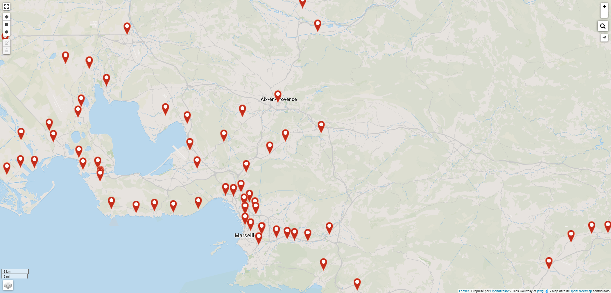
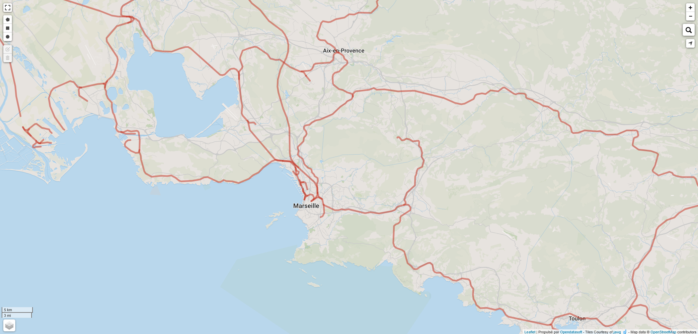
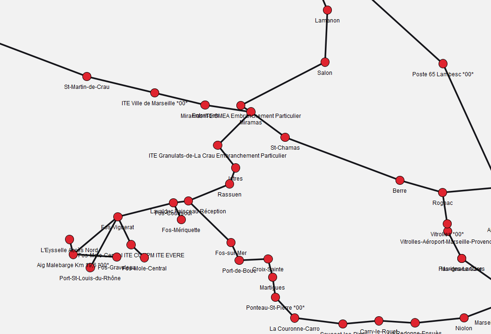
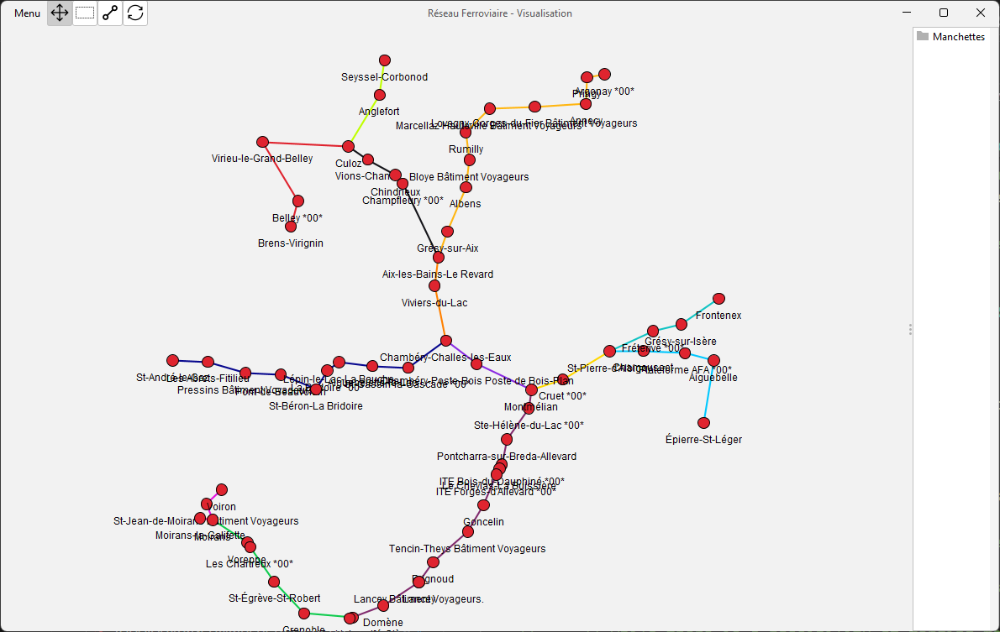
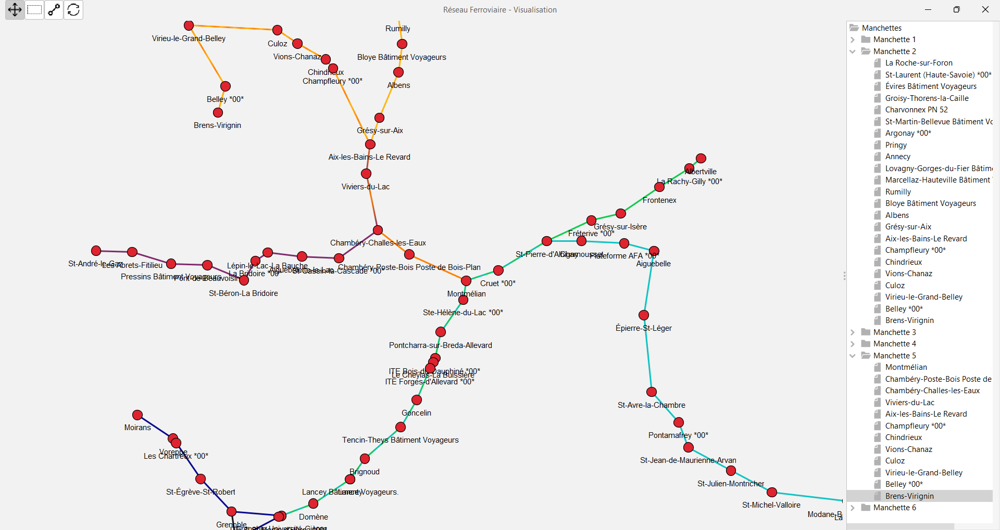

# projet-recherche-SNCF  

This repository addresses an optimization problem provided by **SNCF**, the French railway company : optimizing the visualization of the rail network using "manchettes".  

A "manchette" is essentially a sequence of connected train stations through which various train flows pass. Properly representing manchettes is crucial for managing delays, as a delay at the beginning of a manchette can impact multiple stations downstream. As the railway network expands, it becomes increasingly complex for operators planning train departures and arrivals to monitor all manchettes effectively.  

Given a list of train stations, the connections between them, and the train flows passing through different stations, the goal is to minimize the number of manchettes required to represent the railway network while ensuring that enough manchettes are retained to preserve essential train flow information.  

## Requirements  

- Java Development Kit (JDK) 11 or higher ([Download JDK](https://www.oracle.com/fr/java/technologies/downloads/))  
- Gradle 6.0 or higher ([Installation Guide](https://docs.gradle.org/current/userguide/installation.html))  
- **Required data files (described below).**  

## Installation  

1. Clone the repository:  
    ```sh
    git clone https://github.com/your-username/projet-recherche-SNCF.git && cd projet-recherche-SNCF
    ```  

2. Build the project:  
    ```sh
    ./gradlew build
    ```  

3. Manually add the required data files to the `app/data` folder:  
    - `xml_REF_PROD_S01.xml` (notable railway points)  
    - `flows.json` (train flow data representing traffic on the railway network)  

## Running the Application  

To start the application, run:  
```sh
./gradlew run
```  

## Results  

You can find the results of this project here:  

### Photos  
  
*Figure 1 : Train stations from open data*

  
*Figure 2 : Train lines from open data*

  
*Figure 3 : Representation of the railway topology through a graph*

  
*Figure 4 : Results of basic "manchettes" generation*

  
*Figure 5 : Results of the algorithm aiming to reduce the number of "manchettes"*

### Videos

*Figure 6 : Example of usage of the UI, navigating accross the map*


*Figure 7 : Handling station selection*
